# PairBite - 情侣小厨房

一个为情侣设计的微信小程序，帮助两个人一起管理菜品、每日点菜、记录饮食生活。

基于微信云开发，零服务器、零运维，开箱即用。部署后可邀请多对情侣共同使用，数据自动隔离。

## 功能概览

- **伴侣绑定**：通过邀请码配对，数据自动双向同步
- **菜品库管理**：添加/编辑菜品，支持分类、图片、描述
- **每日点菜**：从菜品库选菜下单，支持备注，伴侣实时收到通知
- **历史记录**：查看所有点菜历史，支持"再来一单"快速复用
- **分类管理**：自定义菜品分类（荤菜/素菜/汤品/主食等），支持排序
- **订阅通知**：点菜后自动向伴侣推送微信订阅消息
- **厨房命名**：自定义小厨房名称，双方同步显示

<p>
  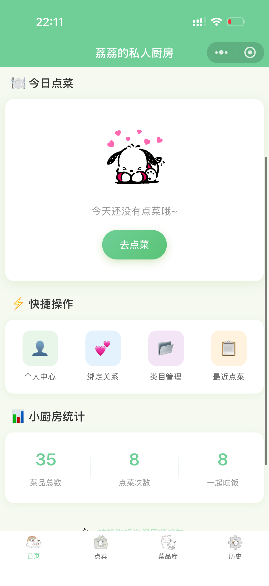
  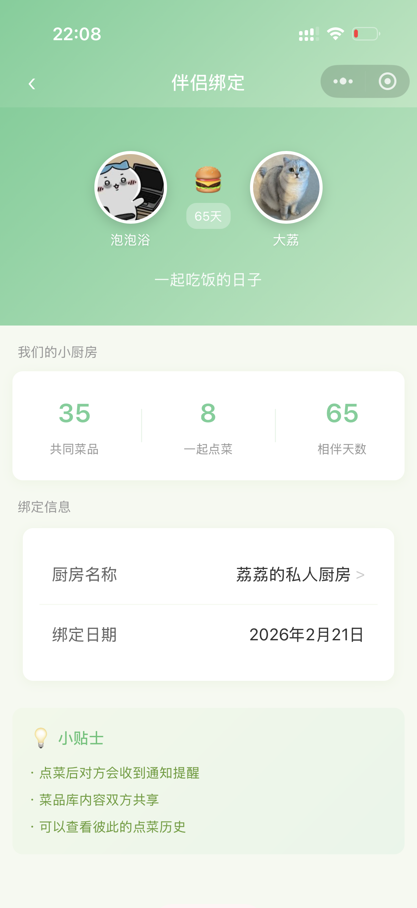
  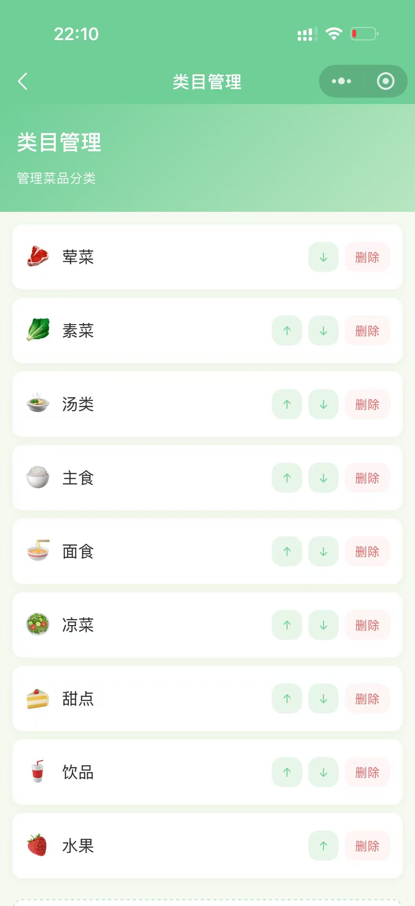
  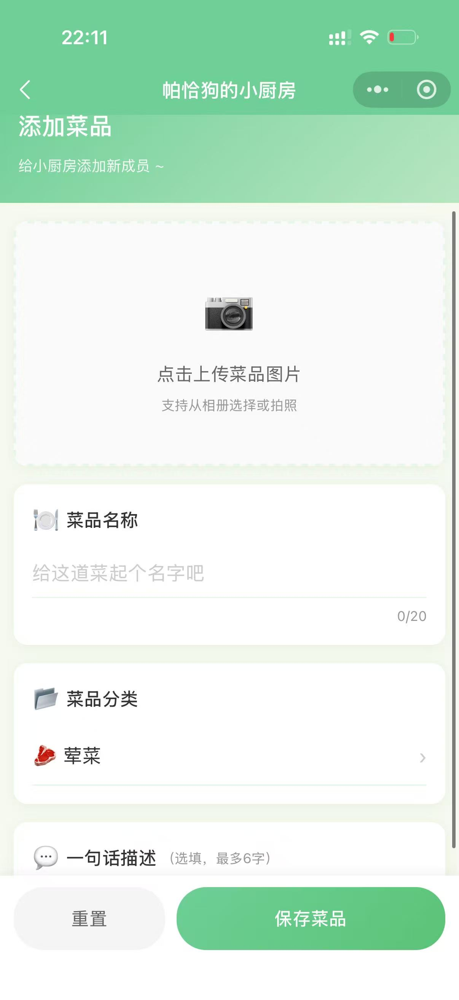
</p>
<p>
  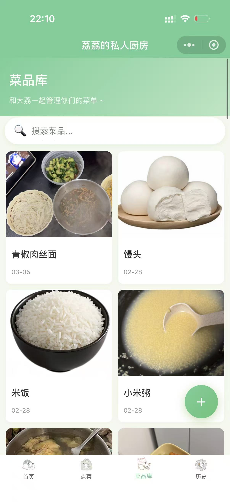
  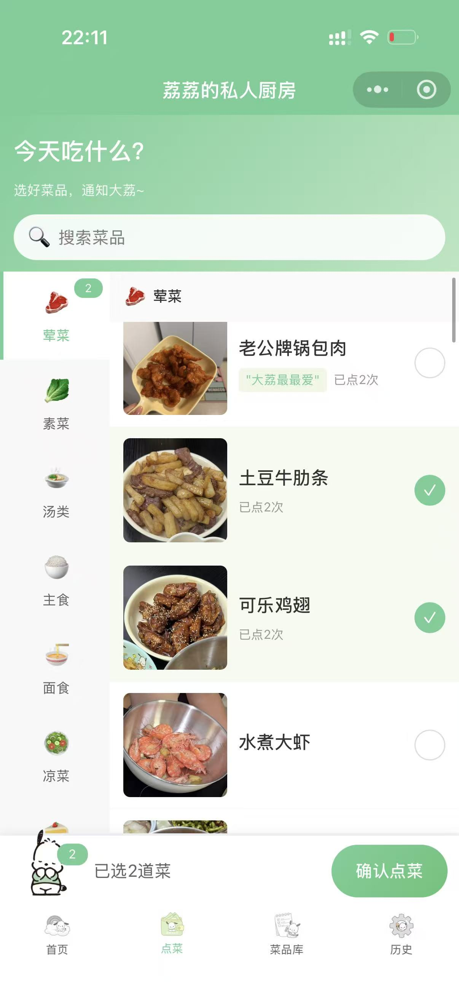
  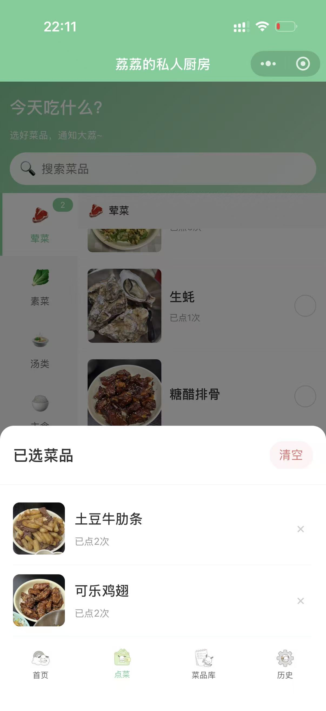
  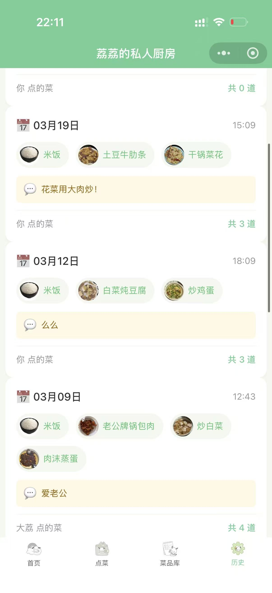
</p>

## 技术栈

| 层 | 技术 | 说明 |
|---|------|------|
| 前端 | 微信小程序原生 | WXML + WXSS + JS |
| UI | WeUI | 微信官方组件库 |
| 后端 | 微信云函数 | Node.js + wx-server-sdk |
| 数据库 | 微信云数据库 | NoSQL 文档数据库 |
| 存储 | 微信云存储 | 菜品图片 |
| 通知 | 微信订阅消息 | 点菜/新菜品通知 |

无任何第三方 API 依赖，完全运行在微信云开发生态内。

## 项目结构

```
├── miniprogram/                # 小程序前端
│   ├── app.js                  # 全局逻辑（用户管理、绑定守卫、云初始化）
│   ├── app.json                # 页面路由与 TabBar 配置
│   ├── app.wxss                # 全局样式
│   ├── envList.js              # 云环境配置 ← 需要修改
│   ├── components/
│   │   └── bind-guard/         # 绑定状态提醒组件
│   └── pages/
│       ├── MainPage/           # 首页（情侣卡片、今日点菜、快捷入口）
│       ├── Order/              # 点菜页（分类选菜、购物车）
│       ├── Dishes/             # 菜品库浏览
│       ├── DishAdd/            # 添加/编辑菜品
│       ├── DishDetail/         # 菜品详情
│       ├── OrderHistory/       # 历史记录
│       ├── OrderDetail/        # 订单详情
│       ├── Bind/               # 伴侣绑定
│       ├── Settings/           # 个人设置
│       └── CategoryManage/     # 分类管理
├── cloudfunctions/             # 云函数（后端）
│   ├── createUser/             # 用户注册/登录，生成邀请码
│   ├── bindPartner/            # 伴侣配对绑定
│   ├── unbindPartner/          # 解除绑定
│   ├── getCoupleData/          # 查询伴侣共享数据
│   ├── updateCoupleData/       # 更新/删除共享数据
│   ├── manageCategory/         # 分类管理（增删改查 + 默认初始化）
│   ├── updateKitchenName/      # 更新厨房名称
│   ├── sendNotify/             # 发送订阅消息通知
│   └── getOpenId/              # 获取用户 OpenID
├── project.config.json         # 微信开发者工具配置 ← 需要修改
└── LICENSE
```

## 部署指南

### 前置条件

- 安装 [微信开发者工具](https://developers.weixin.qq.com/miniprogram/dev/devtools/download.html)
- 注册一个微信小程序账号（[个人号即可，类目选其他](https://mp.weixin.qq.com/wxopen/waregister?action=step1&source=mpregister&token=&lang=zh_CN)）
- 在微信小程序后台首页，完成【小程序信息】和【小程序类目】的信息补充（小程序类目选 工具->备忘录 即可，并设置为主营类目）

### 第一步：克隆项目

```bash
git clone https://github.com/630999Steven/PairBite.git
```

### 第二步：开通云开发

1. 注册号小程序账号后，去开发者后台获取你的小程序 AppID

   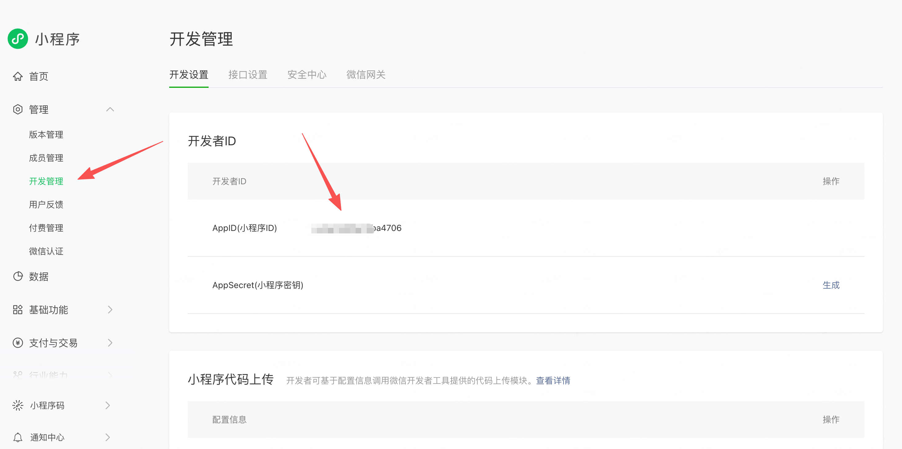

2. 用微信开发者工具打开项目

   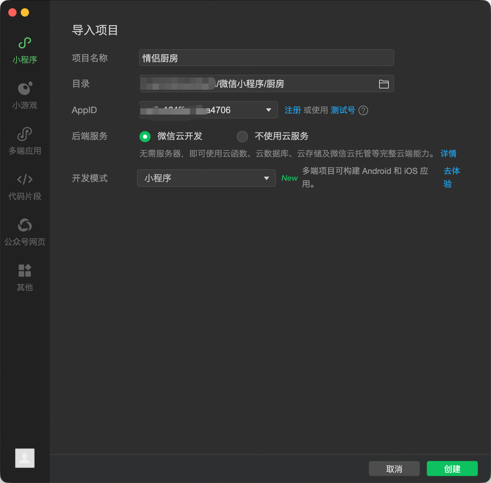

3. 点击工具栏「云开发」按钮（不同版本的微信开发者工具，开通云开发的按钮位置有所不同）

   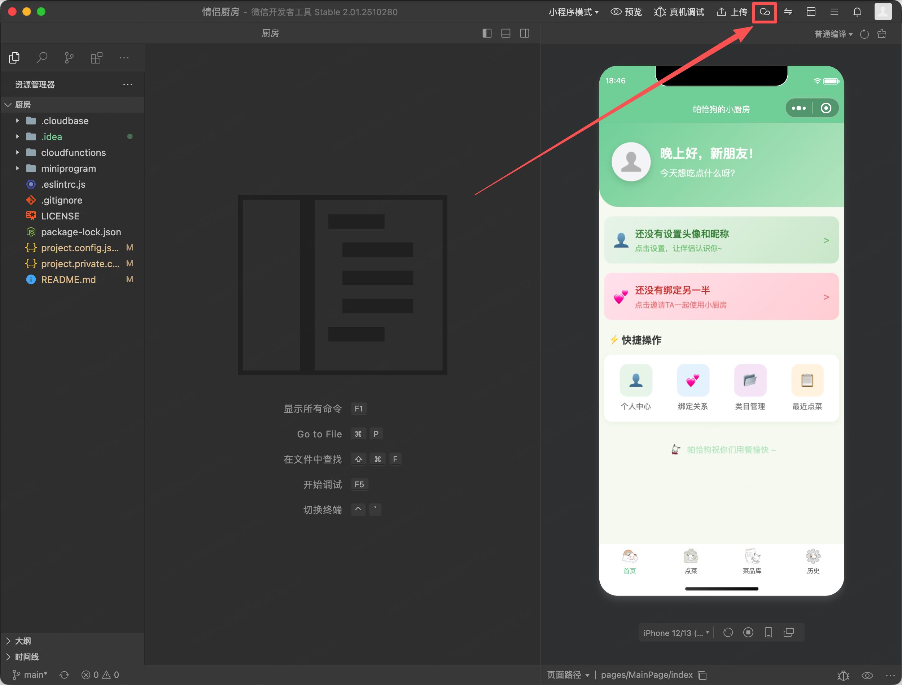

4. 按提示开通云开发环境（选免费基础版即可）

5. 记下你的 **云环境 ID**（格式类似 `cloud1-xxxxxxxxxx`）

   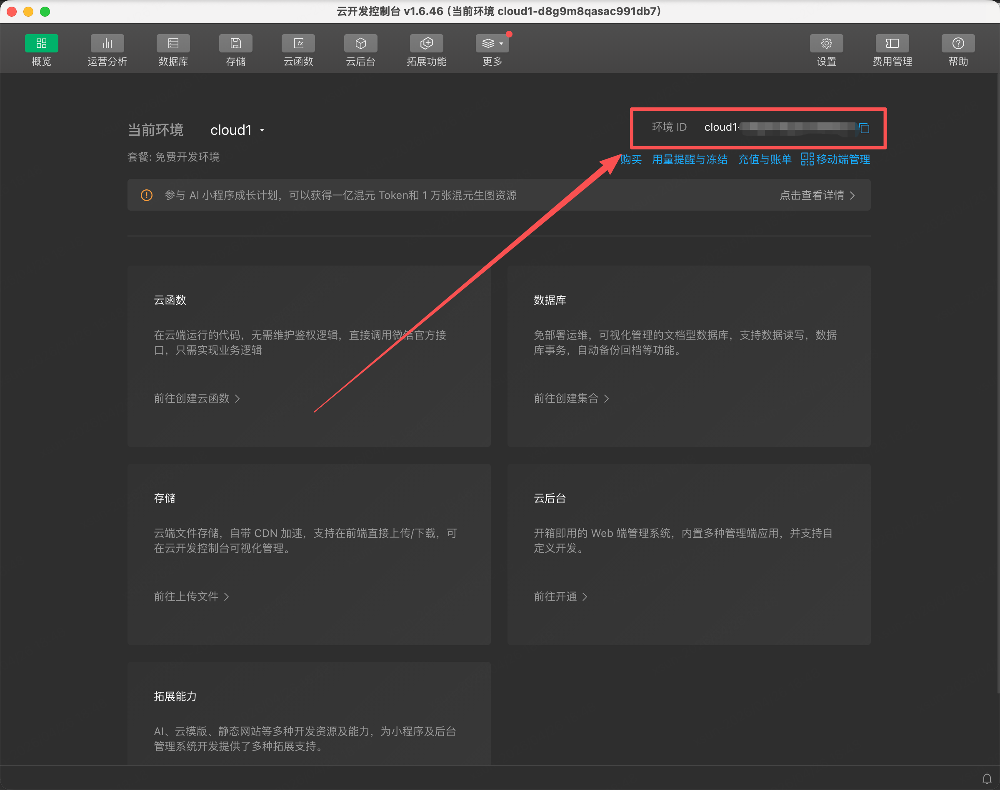

### 第三步：添加数据集合

在云开发平台，选择数据库，添加四个集合：

1. **User**
2. **DishList**
3. **OrderList**
4. **Category**

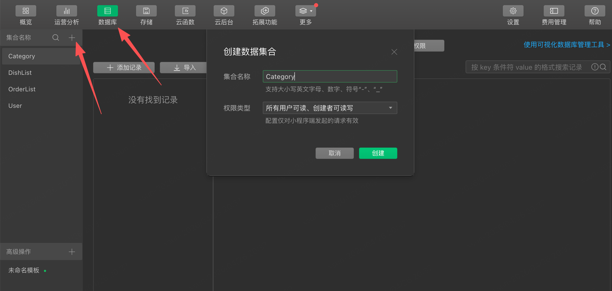

### 第四步：修改配置

回到项目，接下来需要修改两个文件：

**project.config.json** — 替换成你的小程序 AppID：

```json
"appid": "你的小程序AppID"
```

> AppID 在 [微信公众平台](https://mp.weixin.qq.com/) → 开发管理 → 开发设置 中查看

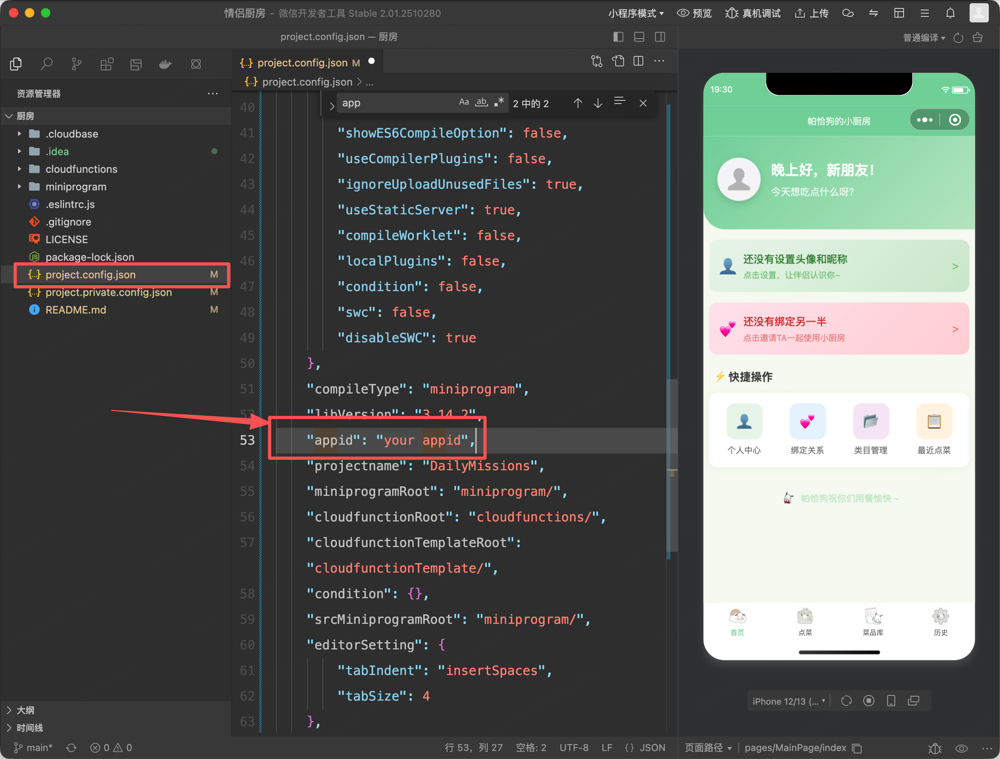

**miniprogram/envList.js** — 替换成你的云环境 ID：

```javascript
const envList = [
  {
    "envId": "你的云环境ID",
    "alias": "cloud"
  }
]
```

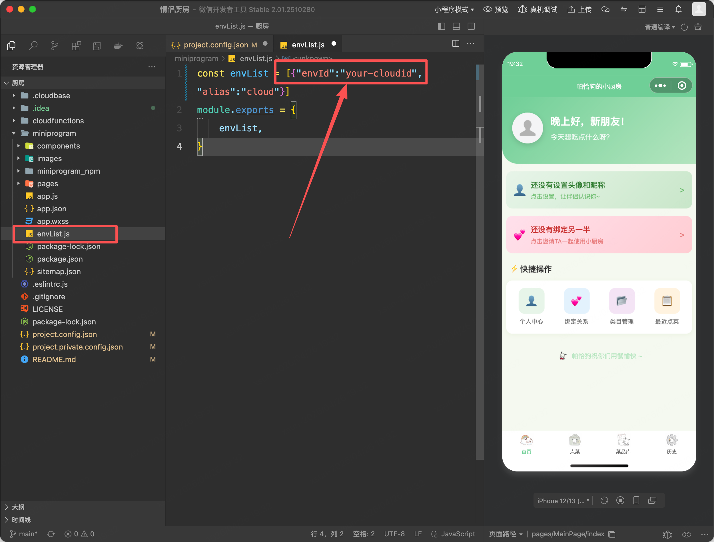

### 第五步：上传云函数

在微信开发者工具中：

1. 选择环境

   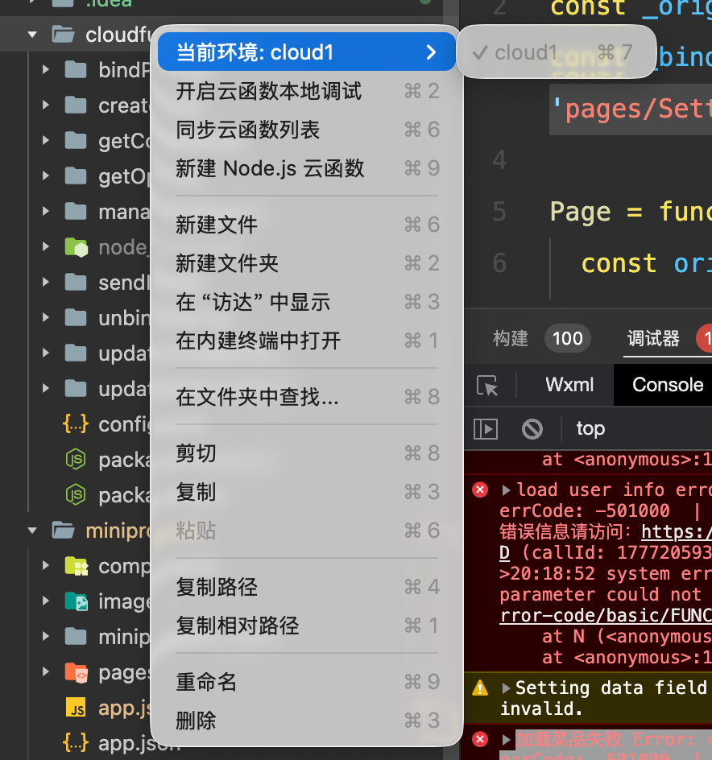

2. 对 `cloudfunctions/` 中的云函数依次执行 → 「上传并部署：云端安装依赖（不上传node_modules）」

共 10 个云函数需要部署：

| 云函数 | 功能 |
|--------|------|
| createUser | 用户注册/登录 |
| bindPartner | 伴侣绑定 |
| unbindPartner | 解除绑定 |
| getCoupleData | 查询共享数据 |
| updateCoupleData | 更新共享数据 |
| manageCategory | 分类管理 |
| updateKitchenName | 厨房命名 |
| sendNotify | 消息通知 |
| getOpenId | 获取 OpenID |
| getFileURL | 图片临时链接转换 |

### 第六步：配置订阅消息模板（可选）

如果需要点菜通知功能：

1. 登录 [微信公众平台](https://mp.weixin.qq.com/) → 基础功能 → 订阅消息 → 公共模板库

   我这里使用【日程提醒】作为模板：

   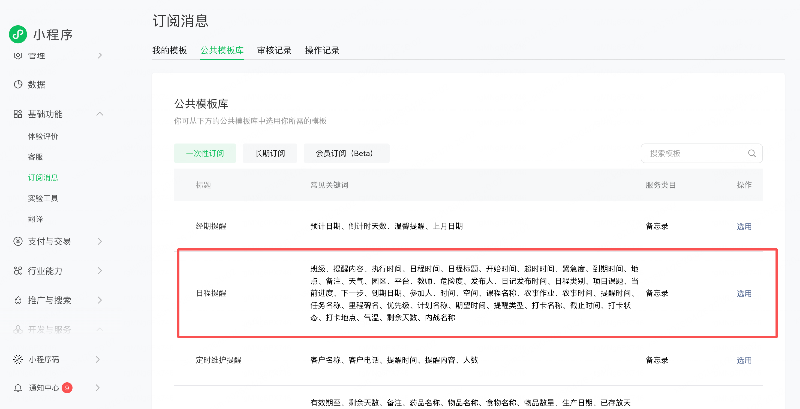

2. 依次搜索并选择包含以下字段：时间、任务名称、提醒内容、备注，添加后提交

   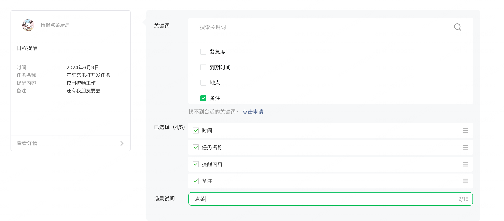

3. 回到【我的模板】，获取模板 ID 后，替换 `miniprogram/app.js` 中 `notifyTmplIds` 的值

> 不配置此步骤不影响核心功能使用，只是不会推送通知。收不到消息看下方「常见问题」

**注意**：如果你和我的模板/字段不完全相同，需要去自行替换每个字段的DATA ID，这里不赘述。

### 第七步：邀请体验成员（必做）

小程序未正式上线前，其他用户需要被添加为**体验成员**才能访问：

1. 登录 [微信公众平台](https://mp.weixin.qq.com/) → 管理 → 成员管理 → 体验成员
2. 点击「添加」，输入对方的微信号
3. 对方在微信中确认后，扫描体验版二维码即可使用

> 个人号最多可添加 15 名体验成员，足够多对情侣一起使用。每对情侣的数据通过 coupleId 隔离，互不干扰。

### 第八步：上传代码并部署小程序

1. 点击微信开发者工具右上角的「上传」将代码上传为体验版（版本号随意），**无需提交审核上架**。

2. 管理 -> 版本管理里，选为体验版，之后扫描二维码即可进入小程序（上一步被添加为成员的人才能扫码使用）

   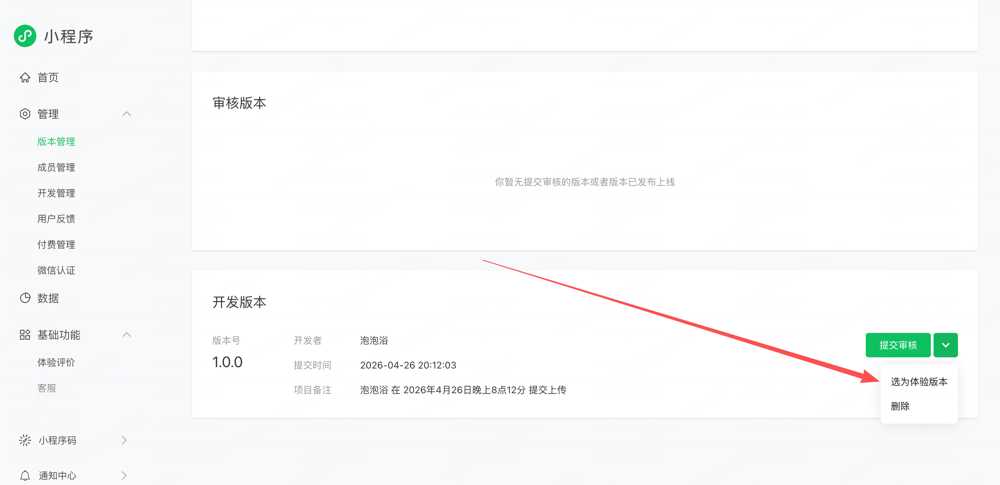

## 使用流程

1. **用户 A** 打开小程序 → 设置头像昵称 → 进入「绑定」页面获取邀请码，给到用户B
2. **用户 B** 打开小程序 → 设置头像昵称 → 输入 A 的邀请码完成绑定
3. 绑定成功后双方共享菜品库，可以互相点菜、查看记录

## 数据库说明

| 集合 | 用途 | 数据隔离 |
|------|------|---------|
| User | 用户信息、绑定关系 | openid |
| DishList | 菜品库 | coupleId |
| OrderList | 点菜记录 | coupleId |
| Category | 菜品分类 | coupleId |

每对情侣通过 `coupleId` 隔离数据，多对情侣共用同一个小程序互不干扰。

## 云开发免费额度

| 资源 | 免费额度 |
|------|---------|
| 数据库存储 | 2 GB |
| 数据库读次数 | 50 万次/天 |
| 云存储容量 | 5 GB |
| 云函数调用 | 40 万次/月 |

情侣日常使用完全在免费额度内。

## 常见问题

**Q：必须要两个人才能用吗？**
A：绑定伴侣后才能使用菜品和点菜功能。单人打开可以看到设置和绑定页面。

**Q：如何换绑伴侣？**
A：在设置页面解除绑定后，重新使用新的邀请码绑定即可。解绑后原有菜品和订单数据仍然保留在原 coupleId 下。

**Q：云函数部署报错怎么办？**
A：先在云函数目录下执行了 `npm install`，再上传部署。如果仍报错，检查 Node.js 版本是否 >= 12。

**Q：订阅消息收不到？**
A：微信订阅消息的授权是给**自己**积攒接收额度，而不是授权给对方发送。因此需要**双方都授权**才能互相收到通知。

目前已在首页快捷入口、点菜提交、绑定成功、查看订单详情等多处埋点触发授权弹窗。建议在弹窗中勾选「总是保持以上选择」并点击允许，之后即可自动接收通知。

**Q：对方看不到我上传的图片？**
A：免费套餐下云存储权限无法改为"所有用户可读"，项目通过 `getFileURL` 云函数将 `cloud://` 文件 ID 转为临时链接来实现双方互看图片。该方案是对免费套餐限制的绕行手段，临时链接有效期约 2 小时（前端缓存 1.5 小时自动续期），长时间停留页面不刷新可能出现图片失效，刷新页面即可恢复。如果你已升级付费套餐，建议将云存储权限改为「所有用户可读」，并切换到 `premium-storage-version` 分支依赖官方使用更简洁可靠的实现。

## 贡献

欢迎提交 Issue 和 Pull Request。

## License

本项目采用 [CC BY-NC-SA 4.0](LICENSE) 协议开源。

- 允许自由使用、修改和分享
- **禁止商业用途**
- 修改后的作品须以相同协议分享
- 须注明原作者
